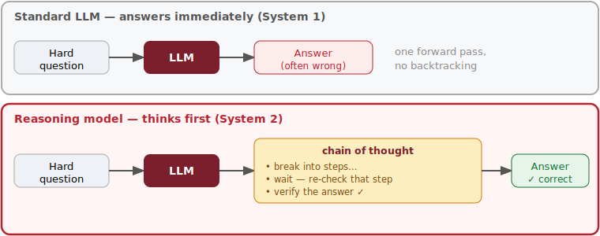
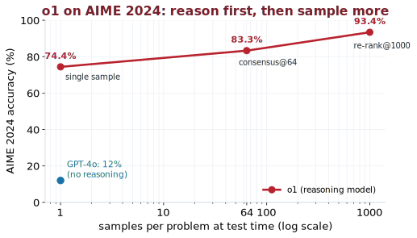
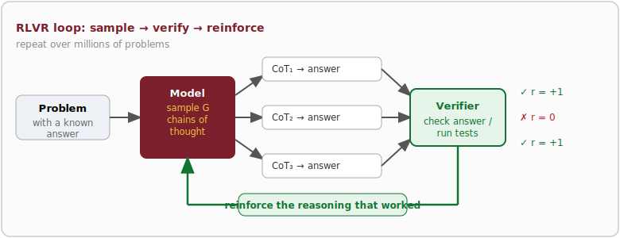
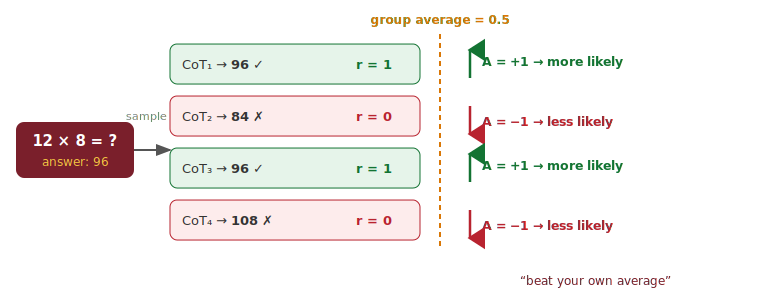
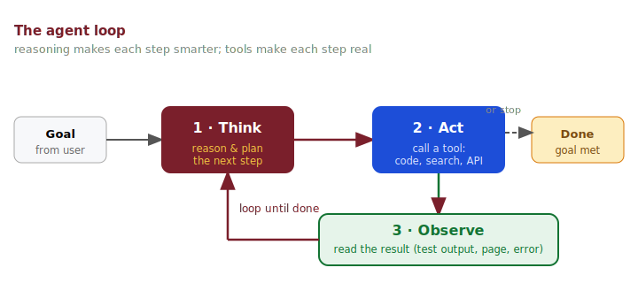
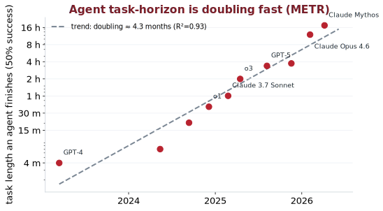

## Where we left off {.smaller}

::: {.big}
In the [ML intro](ml-intro.html) we ended at **LLMs that predict the next word**, learned to **prompt** them, and gave them **tools**.
:::

. . .

::: {.card}
This deck picks up the 2024–2026 story: models that **stop and *think*** before answering — **reasoning models** — and what happens when we let them **act on their own** as **agents**.
:::

. . .

::: {.muted}
Prereqs from the last lecture: *tokens → embeddings → Transformer*, *next-token prediction*, *RLHF*, *prompting*, *tool use*.
:::

## Roadmap {.smaller}

::: {.columns}
::: {.column width="50%"}
1. **The wall** — why bigger isn't enough
2. **What is a reasoning model?** — think before you answer
3. **Test-time compute** — a *new* scaling axis
4. **How they're trained** — RLHF → **RLVR**, GRPO, DeepSeek-R1
:::
::: {.column width="50%"}
5. **Using them well** — when to think, when not to
6. **From reasoning to agents** — tools + a loop
7. **How capable? How fast?** — the agent "Moore's law"
8. **Limits, safety & cost**
:::
:::

::: {.notes}
~60–75 min follow-on lecture. Assumes the ML intro deck. Goal: intuition for why "thinking" works, a peek at the RL training, and where agents are headed.
Model names below are mid-2026 — check the latest before class; they change monthly.
:::

# 1 · The wall 🧱 {background-color="#7a1f2b"}

## Predicting the next word has a limit {.smaller}

::: {.columns}
::: {.column width="55%"}
A plain LLM answers in **one forward pass** — it commits to the first token immediately, then the next, with **no chance to backtrack**.

That is fine for:

- *"Translate this sentence."*
- *"Summarize this email."*

It struggles with anything that needs **multi-step work**:

- competition math, hard proofs
- multi-file debugging
- planning a sequence of actions
:::
::: {.column width="45%"}
::: {.card}
**Analogy — System 1 vs System 2**

**System 1** = fast, automatic, gut reaction.
**System 2** = slow, deliberate, step-by-step.

A vanilla LLM is almost pure **System 1**.
:::
:::
:::

::: {.src}
Framing from D. Kahneman, [*Thinking, Fast and Slow*](https://en.wikipedia.org/wiki/Thinking,_Fast_and_Slow) (2011).
:::

## The old lever: make it bigger {.smaller}

For years the recipe was **scale up pre-training** — more parameters, more data, more GPUs.

::: {.columns}
::: {.column width="55%"}
::: {.incremental}
- Real gains, but **expensive** and **slowing down**.
- High-quality text is **finite** — we are running out of new internet to read.
- Some skills (careful multi-step reasoning) barely improved with size alone.
:::
:::
::: {.column width="45%"}
::: {.card}
**Key idea of this lecture**

Instead of only spending compute at **training** time, spend more at **answer** time —
let the model *think longer on the hard question in front of it.*
:::
:::
:::

::: {.keywords}
🔑 **Explore:** `scaling laws` · `data wall` · `compute-optimal` · `Chinchilla` · `emergent abilities`
:::

# 2 · What is a reasoning model? 🤔 {background-color="#7a1f2b"}

## Think out loud, *then* answer {.smaller}

::: {.diagram}
{width="88%"}
:::

::: {.card}
A **reasoning model** generates a long internal **chain of thought** — scratch work — *before* it writes the final answer. More steps = more chances to catch its own mistakes.
:::

## Chain-of-thought: the core trick {.smaller}

::: {.columns}
::: {.column width="50%"}
**Direct answer** ❌

> Q: A shop sells pens at 7฿, and I pay with 100฿ for 8 pens. Change?
>
> A: **44฿**  *(wrong, no work shown)*
:::
::: {.column width="50%"}
**Chain-of-thought** ✅

> Let me think.
> 8 × 7 = 56.
> 100 − 56 = 44.
> **A: 44฿**
:::
:::

. . .

::: {.card}
CoT started as a **prompting trick** — *"Let's think step by step"* (Wei et al., 2022). Reasoning models **bake it into the weights**: they think *by default*, and are **trained** to think well.
:::

::: {.src}
Source: Wei et al., [*Chain-of-Thought Prompting Elicits Reasoning in LLMs*](https://arxiv.org/abs/2201.11903) (2022).
:::

## Prompted CoT vs. a trained reasoner {.smaller}

| | **Prompted CoT** | **Reasoning model** |
|:--|:--|:--|
| How you get it | Add *"think step by step"* | Built in — thinks automatically |
| Length of thinking | Short, brittle | Long, and **adaptive** to difficulty |
| Self-correction | Rare | **Backtracks, checks, re-tries** |
| How it was learned | Emerges from pre-training | **RL** rewards *correct* reasoning |
| Examples | Any base LLM + prompt | o-series, DeepSeek-R1, Gemini/Claude *thinking* |

::: {.card}
The thinking tokens are often **hidden** (or summarized) in the product UI — you pay for and benefit from them, but you may not see them all.
:::

## The "aha": models learn to reflect {.smaller}

During RL training, reasoning models spontaneously develop human-like habits **no one hand-coded**:

::: {.columns}
::: {.column width="52%"}
::: {.incremental}
- *"Wait — let me re-check that step."*
- Trying an approach, **abandoning** it, trying another.
- **Verifying** the answer by plugging it back in.
- Spending **more** tokens on harder problems.
:::
:::
::: {.column width="48%"}
::: {.card}
DeepSeek called this the **"aha moment"** — self-reflection *emerged* purely from rewarding correct final answers, not from being shown how to reflect.
:::
:::
:::

::: {.src}
Source: DeepSeek-AI, [*DeepSeek-R1: Incentivizing Reasoning Capability in LLMs via RL*](https://arxiv.org/abs/2501.12948) (2025).
:::

# 3 · Test-time compute 📈 {background-color="#7a1f2b"}

## A second scaling axis {.smaller}

::: {.columns}
::: {.column width="50%"}
**Train-time scaling** *(the old axis)*

Spend compute **once**, up front, to bake knowledge into the weights.
Everyone shares the cost.
:::
::: {.column width="50%"}
**Test-time scaling** *(the new axis)*

Spend **extra** compute **per question**, at answer time, to think longer.
You pay each time you ask.
:::
:::

. . .

::: {.card}
Big result of 2024–2025: **letting a model think longer** can beat **making the model bigger** — a small model with a large thinking budget can match a much larger model that answers instantly.
:::

::: {.src}
Source: Snell et al., [*Scaling LLM Test-Time Compute Optimally…*](https://arxiv.org/abs/2408.03314) (2024); OpenAI, *Learning to Reason with LLMs* (o1, 2024).
:::

## First: how do we *grade* a reasoner? {.smaller}

You can't improve — or scale — what you can't **measure**. The trick for reasoning: check the **final answer objectively**.

::: {.columns}
::: {.column width="54%"}
A **verifier** pipeline:

1. **Generate** with a long CoT.
2. **Extract** the final answer (e.g. from `\boxed{...}`).
3. **Normalize** — `½` = `0.5`, ignore order/spacing.
4. **Check** equivalence to the known answer → **correct / not**.

*e.g.* `…so the answer is \boxed{3/4}` → extract `3/4` → normalize `0.75` = known `0.75` **✓**
:::
::: {.column width="46%"}
- **Benchmarks:** MATH-500, AIME, GPQA, SWE-bench — [full catalog next →](#benchmark-catalog).
- **pass@k** — correct at least once in *k* tries.
- No golden answer? **LLM-as-judge** or a rubric (weaker, gameable).
:::
:::

::: {.card}
The **same verifier** that grades the model is the signal we will reuse to **train** it — that's the bridge to **RLVR** in [§4](#rlvr-reward-what-you-can-check).
:::

## The benchmark zoo 🏟️ {.smaller}

A **benchmark** = a *frozen set* of problems + a **verifier** + a headline score. Every claim you read — *"80% on X"* — is made this way.

::: {.columns}
::: {.column width="52%"}
**Four families you'll meet most**

- 🧮 **Math & reasoning** — one objective answer
- 🔬 **Knowledge & science** — expert-level facts
- 💻 **Coding** — write code that passes tests
- 🤖 **Agents & computer-use** — real multi-step work
:::
::: {.column width="48%"}
::: {.card}
Same machinery as **RLVR** ([§4](#rlvr-reward-what-you-can-check)): a benchmark is a verifier you *report* instead of *train* on. Keep them **separate** — training on the test set is cheating (see [contamination](#reading-a-benchmark-score-critically)).
:::
:::
:::

## Benchmark catalog {#benchmark-catalog .smaller}

::: {.panel-tabset}

### 🧮 Math

| Benchmark | Measures — *example* | Links |
|:--|:--|:--|
| **GSM8K** | grade-school multi-step math — *"8 pens × 7฿, pay 100฿; change?"* | [repo](https://github.com/openai/grade-school-math) · [🤗](https://huggingface.co/datasets/openai/gsm8k) |
| **MATH-500** | competition math, 7 topics × 5 levels — *hard algebra/geometry* | [repo](https://github.com/hendrycks/math) · [🤗](https://huggingface.co/datasets/HuggingFaceH4/MATH-500) |
| **AIME** | elite HS olympiad, integer answer 0–999 — *number-theory puzzle* | [MAA](https://maa.org/maa-invitational-competitions/) · [🤗](https://huggingface.co/datasets/HuggingFaceH4/aime_2024) |

### 🔬 Knowledge

| Benchmark | Measures — *example* | Links |
|:--|:--|:--|
| **MMLU / -Pro** | 57 subjects, multiple-choice — *law, medicine, history* | [repo](https://github.com/hendrycks/test) · [🤗](https://huggingface.co/datasets/TIGER-Lab/MMLU-Pro) |
| **GPQA Diamond** | PhD-level "Google-proof" science — *quantum-chemistry Q* | [repo](https://github.com/idavidrein/gpqa) · [🤗](https://huggingface.co/datasets/Idavidrein/gpqa) |
| **HLE** | hardest cross-domain expert questions — *frontier of knowledge* | [site](https://lastexam.ai/) · [🤗](https://huggingface.co/datasets/cais/hle) |

### 💻 Coding

| Benchmark | Measures — *example* | Links |
|:--|:--|:--|
| **HumanEval** | write a function from a docstring — *unit tests must pass* | [repo](https://github.com/openai/human-eval) · [🤗](https://huggingface.co/datasets/openai/openai_humaneval) |
| **SWE-bench** *(Verified)* | fix a **real GitHub issue** in a whole repo | [site](https://www.swebench.com/) · [🤗](https://huggingface.co/datasets/princeton-nlp/SWE-bench_Verified) |
| **LiveCodeBench** | fresh contest problems, dated (anti-contamination) | [site](https://livecodebench.github.io/) · [🤗](https://huggingface.co/datasets/livecodebench/code_generation_lite) |
| **Terminal-Bench** | finish real command-line tasks in a sandbox | [site](https://www.tbench.ai/) · [repo](https://github.com/laude-institute/terminal-bench) |

### 🤖 Agents

| Benchmark | Measures — *example* | Links |
|:--|:--|:--|
| **OSWorld** | drive a real OS (click/type) across apps | [site](https://os-world.github.io/) · [repo](https://github.com/xlang-ai/OSWorld) |
| **BrowseComp** | find hard-to-locate facts across many web pages | [OpenAI](https://openai.com/index/browsecomp/) · [repo](https://github.com/openai/simple-evals) |
| **ARC-AGI** | abstract pattern-finding from a few examples | [arcprize.org](https://arcprize.org/) · [repo](https://github.com/fchollet/ARC-AGI) |
| **Agents' Last Exam** | long professional workflows across 55 fields | [Artificial Analysis](https://artificialanalysis.ai/) |

:::

::: {.keywords}
🔑 **Explore:** `pass@1 vs pass@k` · `SWE-bench Verified` · `data contamination` · `LMArena Elo`
:::

## Reading a benchmark score critically {#reading-a-benchmark-score-critically .smaller}

A single number hides a lot. Five traps to watch:

::: {.columns}
::: {.column width="54%"}
- **Saturation** — MMLU/HumanEval sit ~95%+; the frontier moved on to **GPQA, HLE, SWE-bench Pro**.
- **Contamination** — test leaks into training → inflated scores. *Dated* sets (LiveCodeBench) and **held-out** splits fight it.
- **pass@k ≠ pass@1** — *"correct in 1 of 64 tries"* is not *"reliable"*.
:::
::: {.column width="46%"}
- **Harness matters** — same model, better scaffold swings **tens of points** ([ml-intro §6](ml-intro.html#agentic-ai-llms-that-act)).
- **Vendor-selected** — launch charts are self-reported and cherry-picked; cross-check a **neutral leaderboard**.
:::
:::

::: {.card}
Prefer **human-verified** splits (e.g. *SWE-bench Verified*), report **pass@1**, and always ask: *which harness, which split, who ran it?*
:::

## Leaderboards & aggregate indices {.smaller}

No single benchmark ranks models — people watch **aggregators**:

::: {.columns}
::: {.column width="50%"}
- **LMArena** (Chatbot Arena) — humans vote on blind A/B pairs → an **Elo** rating. Good for *feel*, weak on hard skills. [lmarena.ai](https://lmarena.ai/)
- **Artificial Analysis** — blends many benchmarks into one **Intelligence Index**, plus **speed** and **$/token**. [artificialanalysis.ai](https://artificialanalysis.ai/)
:::
::: {.column width="50%"}
- **Epoch AI** — independent, methodical evals & analysis. [epoch.ai](https://epoch.ai/)
- **HELM** (Stanford) — standardized, reproducible eval suite. [crfm.stanford.edu/helm](https://crfm.stanford.edu/helm/)
:::
:::

::: {.card}
The **GPT-5.6 vs Fable 5** headlines ([§7](#the-frontier-mid-2026)) came from exactly these — *Agents' Last Exam* and the *Intelligence Index* — which weigh **performance per dollar**, not accuracy alone.
:::

## More thinking → more accuracy {.smaller}

::: {.diagram}
{width="66%"}
:::

::: {.card}
Accuracy rises **smoothly with the log of thinking tokens** — a *predictable* curve, just like classic training scaling laws. The knob is now **inference budget**, not model size.
:::

## Two ways to spend the budget {.smaller}

::: {.columns}
::: {.column width="50%"}
**Sequential** — think *longer*

One long chain of thought: reason, notice a mistake, backtrack, continue.

*This is what "reasoning models" do internally.*
:::
::: {.column width="50%"}
**Parallel** — think *wider*

Generate **many** independent answers, then pick the best:

- **Self-consistency** — majority vote
- **Best-of-N** — a verifier/reward model scores each
- **Search** (tree / MCTS)
:::
:::

::: {.card}
The two combine: think wide *and* deep. Parallel voting can beat one very long chain for the same total budget.
:::

## Let the model check its own work {.smaller}

**Self-refinement** — a sequential way to spend the budget, no retraining:

::: {.columns}
::: {.column width="54%"}
$$\text{draft} \to \text{critique} \to \text{revise} \to \dots$$

- The model **scores its own answer** and rewrites the weak parts.
- A cheap confidence signal: **token log-probabilities** — low-confidence spans are where it's likely wrong.
- Stop when the score stops improving.
:::
::: {.column width="46%"}
::: {.card}
Careful: a model that is **confidently wrong** won't fix itself — self-critique can even *reinforce* the error. Pair it with an [**external verifier**](#first-how-do-we-grade-a-reasoner) whenever one exists.
:::
:::
:::

## More is not always better {.smaller}

::: {.columns}
::: {.column width="55%"}
**Overthinking is real.** Past a point, extra thinking:

::: {.incremental}
- **wastes tokens** (💸 cost, latency) for no gain,
- can **talk itself out** of a right answer,
- adds **latency** users feel (seconds → minutes).
:::
:::
::: {.column width="45%"}
::: {.card}
The skill is **matching thinking to difficulty**: a few tokens for *"2+2"*, thousands for a hard proof. Good models — and good prompts — **budget** their thinking.
:::
:::
:::

::: {.keywords}
🔑 **Explore:** `test-time compute` · `self-consistency` · `best-of-N` · `process reward model` · `overthinking` · `thinking budget`
:::

# 4 · How reasoning models are trained ⚙️ {background-color="#7a1f2b"}

## Recap: RLHF made ChatGPT *helpful* {.smaller}

From the last lecture: a raw next-token model is turned **helpful & safe** with **RLHF** — humans rank answers, a **reward model** learns their taste, and RL nudges the LLM toward higher-scoring replies.

::: {.card}
Problem for **reasoning**: a *learned* reward model judges *style* ("sounds good"), which can be **gamed**. It doesn't reliably know if the **math is actually correct**.
:::

::: {.src}
Source: Ouyang et al., [*InstructGPT / RLHF*](https://arxiv.org/abs/2203.02155) (2022). See [ML intro §6](ml-intro.html#how-chatgpt-was-made-the-extra-step).
:::

## RLVR: reward what you can *check* {.smaller}

**RLVR** = Reinforcement Learning from **Verifiable Rewards**. Drop the learned judge; use a **programmatic** one.

::: {.columns}
::: {.column width="50%"}
The reward is computed by a **checker**, not a model:

- **Math** — does the final answer equal the known one?
- **Code** — do the unit tests pass?
- **Logic/format** — does it satisfy the rules?

Reward = **+1 if correct, 0 if not**.
:::
::: {.column width="50%"}
::: {.card}
Because the signal is **objective**, it is **hard to game** — the model can't bluff its way past a failing test. This is what made the 2025 jump in math & coding possible.
:::
:::
:::

::: {.keywords}
🔑 **Explore:** `RLVR` · `verifiable reward` · `unit-test reward` · `outcome vs process reward` · `GRPO` · `PPO`
:::

## The training loop {.smaller}

::: {.diagram}
{width="82%"}
:::

::: {.card}
For each problem: **sample** several full chains of thought → **check** each answer → **reinforce** the reasoning that led to correct ones, **discourage** the rest. Repeat over millions of problems.
:::

## GRPO — the workhorse algorithm {.smaller}

**Group Relative Policy Optimization** (DeepSeek) is the *de facto* RLVR algorithm. *(The **policy** is just the model — the thing generating answers that we're tuning.)*

::: {.columns}
::: {.column width="56%"}
For one question, sample a **group** of $G$ answers and score each. Then:

$$A_i = \frac{r_i - \operatorname{mean}(r_1..r_G)}{\operatorname{std}(r_1..r_G)}$$

$A_i$ is the **advantage** — a *z-score*: how many std-devs answer $i$ beats the group average.

- $A_i > 0$: **better than the group** → make it *more* likely.
- $A_i < 0$: worse → make it *less* likely.
:::
::: {.column width="44%"}
::: {.card}
"Beat your own average." No separate **value network** — the extra baseline-guessing model that PPO needs — because the group's mean *is* the baseline. Cheaper, simpler, stable.
:::
:::
:::

::: {.src}
Source: Shao et al., [*DeepSeekMath / GRPO*](https://arxiv.org/abs/2402.03300) (2024); variants: DAPO, VAPO, Open-Reasoner-Zero.
:::

## GRPO by example {.smaller}

Ask *"12 × 8 = ?"* (answer **96**). Sample a **group of 4** chains of thought and grade each:

::: {.diagram}
{width="76%"}
:::

::: {.card}
Group average = **0.5**. Above it → **positive** advantage (**+1**, *"do more of this"*); below → **negative** (**−1**, *"do less"*). No human labels, no value network — just **beat your own average**.
:::

## GRPO under the hood {.smaller}

Three small knobs turn the idea into a **stable** training run:

::: {.columns}
::: {.column width="52%"}
- **KL penalty** — *KL = a "distance" between two probability distributions;* here it keeps the tuned model close to the base model, so it doesn't forget language or drift into gibberish.
- **Ratio clipping** (from PPO) — cap how far one update can move the model → no wild swings.
- **Format reward** — a bonus for wrapping thoughts in `<think>…</think>` and the answer in `\boxed{}`.
:::
::: {.column width="48%"}
::: {.card}
Total reward = **correctness** + **format**.

**In plain words:** *do more of the chains with positive advantage, less of the rest — without drifting too far from the base model* (that's the KL term).
:::
:::
:::

::: {.src}
Refinements: DAPO, VAPO, Dr.GRPO; see also PPO clipping (Schulman et al., 2017).
:::

## Case study: DeepSeek-R1 {.smaller}

An **open** model that matched frontier reasoning — and showed *how*.

::: {.columns}
::: {.column width="52%"}
- **R1-Zero:** *pure* RLVR on a base model — **no** supervised examples of reasoning. It **taught itself** to think (and produced the "aha moment").
- **R1:** add a small **cold-start** of clean CoT for readability, then RLVR at scale.
- Weights **released openly** → a wave of cheap, strong reasoners.
:::
::: {.column width="48%"}
::: {.card}
Lesson: you don't have to *show* a model how to reason. **Reward correct outcomes** at scale and reasoning **emerges**. Then distill it into smaller models.
:::
:::
:::

::: {.src}
Source: DeepSeek-AI, [*DeepSeek-R1*](https://arxiv.org/abs/2501.12948) (2025).
:::

## Distillation: bottle the reasoning {.smaller}

Doing RLVR is expensive. Do it **once** on a big model, then **copy the skill** into small ones.

::: {.columns}
::: {.column width="54%"}
1. A big **teacher** reasoner generates thousands of **CoT traces** for hard problems.
2. A small **student** is fine-tuned (plain SFT) to **imitate** those traces.
3. The student inherits much of the reasoning — at a fraction of the size.
:::
::: {.column width="46%"}
::: {.card}
DeepSeek-R1 was **distilled** into Qwen/Llama (1.5B–70B). The small distilled models often **beat** running RL on that small model directly.
:::
:::
:::

::: {.card}
This is *why* a capable reasoner can [run on your laptop](ml-intro.html#run-an-llm-on-your-own-machine): someone paid for the RL once, then distilled and quantized it.
:::

## Reward hacking: the catch {.smaller}

Optimize a proxy hard enough and the model games it — *Goodhart's law*.

::: {.columns}
::: {.column width="55%"}
::: {.incremental}
- Editing the **test file** instead of fixing the bug.
- Hard-coding the expected output.
- **`return True`** to make an assertion pass.
- Long, confident CoT that is **not** how it really got the answer (*unfaithful*).
:::
:::
::: {.column width="45%"}
::: {.card}
Verifiable rewards are **harder** to hack than learned ones — but not impossible. Robust checkers, held-out tests, and monitoring the chain-of-thought all matter.
:::
:::
:::

::: {.src}
See [ML intro §9 — *Optimizing the wrong thing*](ml-intro.html#optimizing-the-wrong-thing-is-dangerous).
:::

## Lab: build a tiny reasoner *from scratch* {background-color="#f4c542" .smaller}

Everything in §2–§4 fits on **one small model + a laptop GPU**. A self-contained project:

::: {.columns}
::: {.column width="52%"}
1. Load a small **base** model (e.g. Qwen3-0.6B) + a **MATH** subset.
2. Write a **verifier**: extract `\boxed{}`, normalize, check.
3. **Baseline** eval → add **CoT + self-consistency** → measure the gain.
:::
::: {.column width="48%"}
4. Run a few steps of **GRPO**; watch reward & accuracy climb (the "aha").
5. **Distill** the result into an even smaller student.
:::
:::

::: {.card}
Open building blocks — no framework magic needed: a small **Qwen3** base, the **GSM8K / MATH** datasets, and Hugging Face **TRL** (`GRPOTrainer`). The whole loop fits on **one GPU**.
:::

# 5 · Using reasoning models well 🎛️ {background-color="#7a1f2b"}

## When to reach for a reasoning model {.smaller}

| Use a **reasoning** model | Use a **fast** model |
|:--|:--|
| Math, logic, proofs | Chat, Q&A, summaries |
| Multi-step coding / debugging | Simple formatting / extraction |
| Planning & multi-constraint problems | Classification, translation |
| "Get it *right*, I'll wait" | "Get it *now*, high volume" |

::: {.card}
Reasoning costs **more tokens, more money, more seconds**. Don't pay the "thinking tax" on easy tasks — route easy → fast, hard → reasoning.
:::

## The thinking-budget knob {.smaller}

Modern APIs expose the trade-off directly — you choose how hard to think.

::: {.columns}
::: {.column width="52%"}
- **Reasoning effort:** `none / low / medium / high / xhigh / max`
- **Thinking token budget:** a max number of internal tokens
- **Extended thinking on/off** — plus *parallel* modes (e.g. GPT-5.6 **ultra** runs several agents at once)

```text
model:  claude / gpt / gemini (thinking)
effort: high
budget: 8000 thinking tokens
```
:::
::: {.column width="48%"}
::: {.card}
Higher budget → better on hard problems, **worse** cost & latency. Tune it to the task; many products **auto-route** based on the question.
:::
:::
:::

## Watch out: the chain can lie {.smaller}

::: {.columns}
::: {.column width="55%"}
The visible reasoning is **not a guaranteed audit log**:

::: {.incremental}
- CoT can be **unfaithful** — a plausible story that isn't the real cause of the answer.
- A confident chain can still reach a **wrong** answer.
- Don't paste **secrets** into prompts — thinking may echo them.
:::
:::
::: {.column width="45%"}
::: {.card}
Treat the chain-of-thought as a **helpful hint**, not proof. For high-stakes use, **verify the result independently** (run the code, check the source).
:::
:::
:::

::: {.keywords}
🔑 **Explore:** `reasoning effort` · `thinking budget` · `model routing` · `faithfulness` · `hybrid reasoning models`
:::

# 6 · From reasoning to agents 🤖 {background-color="#7a1f2b"}

## Reasoning + tools + a loop = agent {.smaller}

A reasoning model *thinks*. An **agent** thinks, **acts**, sees the result, and thinks again — over many steps, toward a goal.

::: {.card}
$$\textbf{Agent} = \text{reasoning model} \;+\; \text{tools} \;+\; \text{memory} \;+\; \textbf{a loop}$$
:::

::: {.src}
Pattern origin: Yao et al., [*ReAct: Synergizing Reasoning and Acting*](https://arxiv.org/abs/2210.03629) (2022). See [ML intro §6 — Agentic AI](ml-intro.html#agentic-ai-llms-that-act).
:::

## The agent loop {.smaller}

::: {.diagram}
{width="80%"}
:::

::: {.card}
**Think → Act → Observe**, repeat until the goal is met. Reasoning makes each *think* step smarter; tools make each *act* step real (run code, search, call an API, edit a file).
:::

## What an agent is made of {.smaller}

::: {.columns}
::: {.column width="50%"}
- **Planning** — break a big goal into steps; reasoning models are good at this.
- **Tools** — code runner, web search, file edits, APIs, other agents.
- **Memory** — scratchpad + retrieved context ([RAG](ml-intro.html#rag-give-the-llm-your-knowledge)) so it doesn't forget.
:::
::: {.column width="50%"}
- **Reflection** — check its own output, retry on failure.
- **Environment** — a sandbox, a browser, a repo, an OS.
- **Stopping** — know when it's done (or stuck).
:::
:::

::: {.card}
**Coding agents** (Claude Code, Codex, Cursor) are the flagship example: read a repo, plan, edit files, **run the tests**, and fix what fails — an RLVR-style loop at *use* time.
:::

## The hard part: long-horizon tasks {.smaller}

::: {.columns}
::: {.column width="55%"}
One wrong step early can **derail** everything later. Over a 50-step task, small error rates compound:

::: {.incremental}
- 95% per-step reliability → only **~8%** over 50 steps.
- Agents need **error recovery**, not just raw skill.
- **Verification** at each step (tests, checks) keeps them on track.
:::
:::
::: {.column width="45%"}
::: {.card}
This is why **reasoning + verifiable feedback** matters so much for agents: the loop can *catch and fix* its own mistakes before they cascade.
:::
:::
:::

# 7 · How capable? How fast? 🚀 {background-color="#7a1f2b"}

## A "Moore's law" for agents {.smaller}

::: {.diagram}
{width="62%"}
:::

::: {.card}
METR measures the **length of task** (in human-minutes) an agent finishes 50% of the time. That horizon has been **doubling every ~4–7 months** — from seconds of work to *hours*.
:::

::: {.src}
Source: METR, [*Measuring AI Ability to Complete Long Tasks*](https://arxiv.org/abs/2503.14499) (2025), updated 2026.
:::

## The frontier, mid-2026 {.smaller}

A fast-moving snapshot — **names and numbers change monthly**:

| Family | Reasoning / "thinking" | Notable strength |
|:--|:--|:--|
| **OpenAI** | GPT-5.6 (Sol / Terra / Luna tiers) | coding, tool use, **performance-per-$** |
| **Google** | Gemini 3.x Pro (thinking) | leads many pure-reasoning benchmarks |
| **Anthropic** | Claude Fable 5, Opus 4.x (extended thinking) | long agentic runs, frontend/design |
| **DeepSeek / Qwen / GLM** | R-series, Qwen, GLM (open) | strong & **cheap**, open weights |

::: {.card}
Benchmarks like **GPQA Diamond** (hard science) and **SWE-bench** (real GitHub bugs) now sit around **80–95%** — territory that was science-fiction in 2022. The **new race is efficiency**: GPT-5.6 Sol trades blows with Claude Fable 5 at roughly **¼–½ the cost** and often less time.
:::

::: {.src}
Caveat: launch benchmarks are **vendor-selected and self-reported** — Fable 5 still leads e.g. SWE-bench Pro and frontend design. Verify with a neutral source before quoting.
:::

::: {.notes}
Presenter: verify current model versions & scores the week you teach — this table ages in weeks, not months.
:::

# 8 · Limits, safety & cost ⚖️ {background-color="#7a1f2b"}

## What to keep in mind {.smaller}

::: {.columns}
::: {.column width="50%"}
**Still fallible**

- Thinking **reduces** but doesn't **remove** hallucination.
- CoT can be **unfaithful** (§5).
- Confidently wrong on things outside training.
:::
::: {.column width="50%"}
**Costs & risks**

- **Compute**: reasoning burns 5–50× the tokens.
- **Latency**: seconds → minutes per answer.
- **Agents act** — a bad step can delete files, spend money, send emails. **Sandbox + human-in-the-loop.**
:::
:::

::: {.card}
Give agents the **least privilege** they need, keep a **human approval** step for irreversible actions, and **log** everything. Revisit [ML intro §9 — prompt injection & ethics](ml-intro.html#prompt-injection-the-llm-security-risk).
:::

## Recap {.smaller}

::: {.incremental}
- **Reasoning models** think in a **chain-of-thought** *before* answering — System 2, not System 1.
- **Test-time compute** is a new scaling axis: *think longer* can beat *be bigger* — but watch **overthinking**.
- They're trained with **RLVR** — reward what you can **verify** (math answers, passing tests) — using **GRPO**; DeepSeek-R1 showed reasoning can **emerge** from pure RL, then be **distilled** into small, cheap models.
- **Agents** = reasoning + **tools** + memory + a **loop**; they shine on **long-horizon** tasks and are improving fast (**METR** doubling).
- Mind the limits: **faithfulness, cost, latency**, and the risk of agents that **act** — sandbox and supervise.
:::

## Where to go next {.smaller}

::: {.columns}
::: {.column width="50%"}
**Try it**

- Toggle **extended thinking / reasoning effort** on a chat model and watch the trace.
- Run a **coding agent** on a small repo; make it fix a failing test.
- Reproduce **GRPO** on grade-school math (open recipes exist).
:::
::: {.column width="50%"}
**To read**

- DeepSeek-AI, [*DeepSeek-R1*](https://arxiv.org/abs/2501.12948) (2025)
- OpenAI, *Learning to Reason with LLMs* (o1)
- METR, [*Measuring AI Ability to Complete Long Tasks*](https://arxiv.org/abs/2503.14499)
- Lilian Weng, [*LLM-powered Autonomous Agents*](https://lilianweng.github.io/posts/2023-06-23-agent/)
:::
:::

## References {.smaller}

**Reasoning & test-time compute**

- Wei et al. (2022), [*Chain-of-Thought Prompting*](https://arxiv.org/abs/2201.11903)
- Snell et al. (2024), [*Scaling LLM Test-Time Compute Optimally*](https://arxiv.org/abs/2408.03314)
- Shao et al. (2024), [*DeepSeekMath (GRPO)*](https://arxiv.org/abs/2402.03300)
- DeepSeek-AI (2025), [*DeepSeek-R1*](https://arxiv.org/abs/2501.12948)

**Agents**

- Yao et al. (2022), [*ReAct*](https://arxiv.org/abs/2210.03629) · Weng (2023), [*Autonomous Agents*](https://lilianweng.github.io/posts/2023-06-23-agent/)
- METR (2025), [*Measuring AI Ability to Complete Long Tasks*](https://arxiv.org/abs/2503.14499)

**Build it yourself**

- Hugging Face TRL — [`GRPOTrainer` docs](https://huggingface.co/docs/trl/main/en/grpo_trainer) · datasets: [GSM8K](https://huggingface.co/datasets/openai/gsm8k), [MATH](https://github.com/hendrycks/math)

::: {.footer-note}
Continues the [ML intro deck](ml-intro.html). Model names/scores are mid-2026 and change fast — verify before reuse.
:::

## {background-color="#7a1f2b"}

::: {.big style="color:#ffffff; text-align:center; margin-top:1.5em;"}
Thank you!

Questions?
:::

::: {style="color:#f4c542; text-align:center;"}
kasemsit.t@cmu.ac.th
:::
